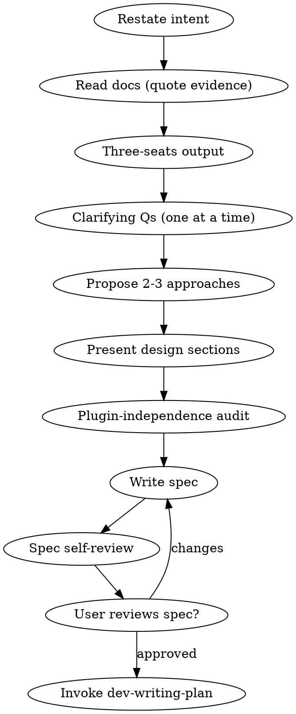

# Dev Brainstorm

Turn an idea into a spec through dialogue, with project grounding and plugin-independence enforcement.

<HARD-GATE>
No implementation, no plan-writing, no subagent dispatch until a spec exists AND the user explicitly approves it. Engagement is not approval; only `yes`/`approved`/`proceed` clears the gate.
</HARD-GATE>

## Anti-pattern: "Too simple to need a spec"

Every change goes through this. The spec can be short. Skipping is where the most rework comes from.

## Checklist (TodoWrite-tracked, in order)

1. **Brainstorm-entry priming.** Before any tool use, produce a chat-visible priming output applying entries tagged `brainstorm-entry`, `brainstorm-iteration`, and `fix-iteration` (if this is a fix cycle) from `.claude/skills/dev-orchestrator/references/priming-anti-patterns.md`. Same format as orchestrator session-entry priming: marker `**Priming**` + name + signal + countermove per applicable entry. "No applicable" requires enumeration.

2. **Restate user intent in one sentence.** Ambiguous? Ask before exploring.

3. **Read project context.** One TodoWrite item per relevant doc; close each only with a quoted load-bearing line. Always: INVARIANTS, BACKLOG, GLOSSARY; TESTING for verification work; plus the project's domain docs from the `CLAUDE.md` Documentation map matched to the work (e.g. a mechanics doc for behavior changes, a UI-layout doc for UI work, interface manifests for API or shared-code changes). Inapplicable docs close as `N/A: <reason>`.

   If `docs/planning/investigations/` contains a recent investigation file related to this task (matched by symptom or date), read it as one of the relevant docs — it's the handoff artifact from `dev-investigate`. Skip TodoWrite items for docs already covered by the investigation.

   Prior-read citations: if a canonical doc was already read earlier this session, citing the prior read counts as evidence. Don't re-quote unnecessarily.

4. **Three-seats output** (one sentence each, required in spec):
   - **User seat:** what the user experiences differently
   - **Data-flow seat:** where the change propagates (source → shared → server → transport → client → UI)
   - **Abstraction seat:** is this the right level of generality? Could a different plugin use the same pattern?

5. **External-source ground check.** When the brainstorm subject names an external system, product, game, or standard (e.g., "Stripe's webhook spec", "the OAuth 2.0 RFC", "a third-party REST API", "an Excel formula", "the iCalendar standard"), the spec MUST include a "Project context — external sources" sub-section with cited URLs + load-bearing claims drawn from the source material, NOT from the user's paraphrase or the agent's memory. WebFetch / WebSearch the canonical sources before drafting design sections. Skip with explicit `No external sources apply — <one-line justification>` when nothing external is referenced. Failure mode this prevents: anchoring on the user's enumeration of features and missing canonical mechanics that should drive design decisions.

6. **Ask clarifying questions, one at a time.** Multiple choice when options are discrete. **Before asking: check the codebase first.** If the question is answerable by Grep / Read against the codebase or project docs, do that first and cite `file:line` in the answer rather than asking. Only surface questions whose answers genuinely aren't in code, docs, or external sources. Failure mode this prevents: burning user turns on questions the agent could have answered itself with a grep.

7. **Propose 2-3 approaches.** Lead with recommendation and why.

8. **Present design sections one at a time.** Get approval per section.

9. **Plugin-independence audit** (when introducing core vocabulary — names registered in the core that extensions consume: event types, op names, status types, registry entries, label keys, template names, selectors). Applies only when the project has a core/extension split (plugins, rulesets, providers, themes, tenants) with the extension directory declared in `CLAUDE.md` or `GLOSSARY.md`; no declared split → close as `No core/extension split — audit N/A`.

   - Inventory extension-specific terms by reading every extension in the declared extension directory — its manifest/config, any definition files, locale bundles, any other file introducing named primitives.
   - For each proposed core name: if it matches or references a term meaningful in only some extensions, it's leaking. Replace with a generic primitive + extension-supplied label/data.
   - Document the audit in the spec under `## Plugin-independence audit`: one entry per proposed name → verdict (generic | leaks from `<extension-id>`) → resolution.

   Skip with explicit `No engine vocabulary added — audit N/A` when nothing introduced.

   Principle: the core and global templates never contain a noun, label, or short-code meaningful in only a subset of extensions. Adding a new extension must require only authoring its own config/data files — never editing the core.

10. **Write the spec** to `docs/planning/specs/active/YYYY-MM-DD-<topic>.md`. Frontmatter `Status: Awaiting Plan`. Sections: Intent, Three-seats output, Project context (quoted evidence summary), Design, Plugin-independence audit (or explicit N/A), Acceptance criteria (concrete user-action sequences), Out of scope. Commit as `docs: spec <topic>`.

   Each acceptance criterion is Yes/No verifiable. Banned phrases: "works correctly", "feels right", "looks good", "handles edge cases", "as appropriate". Self-review step greps for them.

11. **Spec self-review.** Fix inline, no re-review loop:
    - Placeholder scan: `TBD`, `TODO`, `fill in`, `details to follow`, `Similar to <other>`, `Add appropriate <X>`, `handle edge cases`
    - Internal consistency
    - Scope check — decompose if multi-subsystem; declare backend/frontend split if it spans both
    - Ambiguity check — any requirement interpretable two ways? Pick one
    - Copout scan: `pre-existing`, `out of scope` (unjustified), `covered elsewhere`, `engine-proven`, `math is unit-tested`
    - **Engine-state claim audit**: grep the spec for phrases like "the engine already supports", "X exists today", "this is already wired", "the existing Y handles Z". Every such claim MUST have an inline `file:line` citation immediately adjacent — AND, when the design *relies on* that behavior, the cited code must have been read and confirmed to do what the claim says. **A present citation is not verification:** a real `file:line` can still be wrong about what the code does (e.g. claiming a handler writes a record when it actually validates and rejects on a precondition; claiming in-memory state survives restart when it is transient by design). For load-bearing claims, confirm the *execution path* that runs it (pure shared op vs server-deferred vs fallthrough), not just the data shape. Tag each load-bearing claim verified-by-reading vs assumed. Memory-fabricated **and citation-present-but-false** claims are the recurring failure mode.
    - **Acceptance criteria layer check**: AC steps describe observable outcomes ("the activity log shows a `discount=0.5` entry", "the account header reflects `credits=200`"), NOT executable test-code snippets (`expect(x).toBe(y)`). Test code belongs to the writing-plan / build phase where the test framework's APIs are verified. Inlining test code in a spec pushes the plan-author into authoring matching code based on unverified API assumptions.

<HARD-GATE>
Dispatch the `dev-reviewer` agent for the spec just written:

- artifact-path: the spec file path just written
- artifact-type: `spec`
- reviews-output-path: `docs/planning/reviews/<slug>-spec.md` (where `<slug>` is the spec filename basename)
- references-base: `.claude/skills/dev-orchestrator/references/review-gates/`

Read the resulting reviews file. The `**Status:**` line gates progress:

- `**Status:** approved` → proceed to step 12.
- `**Status:** rejected` → read the cited violations, fix the spec inline, re-dispatch the reviewer. Loop until approved.

The reviewer's neutrality is structural (fresh agent context). Do not skip the dispatch; do not self-review in place of dispatch.
</HARD-GATE>

12. **Present spec for user review.** Single-content message: "Spec written and committed to `<path>`. Please review before we move to writing the plan." Wait for explicit approval.

13. **Spec approved.** After the user approves, note the approved spec path for writing-plan (the plan inherits the spec's slug — the filename basename, e.g. `2026-05-25-foo`).

14. **Transition to dev-writing-plan.** Terminal state. No other skill invoked.

## Process flow

## Cross-cutting rules

Communication discipline, engagement-vs-approval, hard-correction handling, length ceilings, jargon discipline — defined in `dev-orchestrator`. Re-read that block before every user-facing message.
