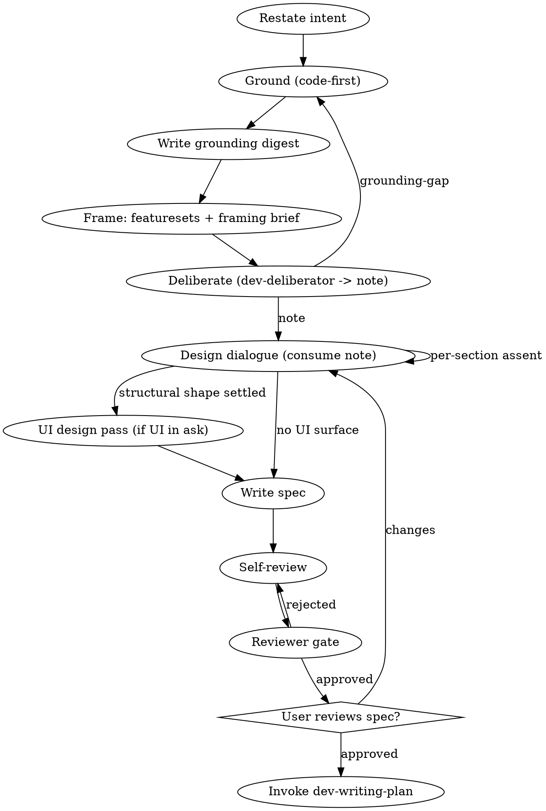

# Dev Brainstorm

Turn an idea into a spec through dialogue, grounded in code and encoded at the right abstraction level.

<ENTRY-GUARD>
Run only if `▸ pipeline-position: brainstorm (via orchestrator)` was printed above this invocation in the current session. Absent → you were reached outside the orchestrator; stop and hand back to it. You are never an entry point — the orchestrator is the only door.
</ENTRY-GUARD>

<HARD-GATE>
No implementation, no plan-writing, no subagent dispatch until a spec exists AND the user explicitly approves it. Engagement is not approval; only `yes`/`approved`/`proceed` clears the gate.
</HARD-GATE>

## Anti-pattern: "Too simple to need a spec"

Every change goes through this. The spec can be short. Skipping is where the most rework comes from.

## Checklist (TodoWrite-tracked, in order)

1. **Brainstorm-entry priming.** Before any tool use, produce chat-visible priming for entries tagged `brainstorm-entry`, `brainstorm-iteration`, `fix-iteration` (fix cycles) in `.claude/skills/dev-orchestrator/references/priming-anti-patterns.md`. Format: `**Priming**` + name + signal + countermove. "No applicable" requires enumeration.

2. **Restate user intent in one sentence.** Ambiguous? Ask before exploring.

3. **Ground in the primary source — code + config; docs are the index.** Code is the truth; a doc is a description that drifts (this is the orchestrator §Grounding rule, applied here). Output: the spec's Project-context section.
   - **Docs locate, code confirms.** Use the project's `CLAUDE.md` Documentation map to find which docs bear on this work, and read those — let the task decide, don't read a fixed list. Start with the core: the domain docs covering this topic, and the ADRs/invariants that record the codebase's design decisions and constraints. Then whatever the task calls for — a testing doc for verification work; a glossary only when terms are unfamiliar. One TodoWrite item per relevant doc; inapplicable → `N/A: <reason>`. Then **read the actual code/config those point to** and confirm what it does, including the path that actually runs it, not just the data shape. Close each item with a quoted line. Behavior claims cite the **code** `file:line` (primary), not docs. Verify every `file:line` by reading it this session — stale anchors misread downstream. Read any matching `docs/planning/investigations/` handoff too (the `dev-investigate` artifact); skip items it already covers. A source read earlier this session counts; don't re-quote unnecessarily.
   - **As-is lived-path trace.** Walk one real *current* use end to end across the project's data-flow layers: name the execution path (which handler actually runs it, not just where the data sits), the seams, and where any named hack/fallback sits. The deliberator transforms this trace and cannot produce it; thin or missing → it returns `grounding-gap`.
   - **External sources.** When the subject names an external system/product/standard ("Stripe's webhook spec", "the OAuth 2.0 RFC", "a third-party REST API", "the iCalendar standard"), the spec MUST carry a "Project context — external sources" sub-section: cited URLs + claims from the source, not paraphrase or memory. WebFetch/WebSearch before drafting. Else `No external sources apply — <why>`.
   - **Posture.** The Project-context header declares grounding once ("grounded this session, verified by reading"); claims default to verified-by-reading-the-source, and any claim NOT read this session is inline-tagged `[assumed]` or `[secondary: <source>]` (a doc-only behavior claim is `[secondary: <doc>]` until confirmed against code). Marking the exceptions beats tagging every line.

4. **Write the grounding digest** → `docs/planning/deliberations/<slug>-grounding.md` (`<slug>` = spec slug). The deliberator's only input — facts and shapes, never raw code dumps. Include:
   - the **as-is lived-path trace** (step 3);
   - the load-bearing facts, real constraints, and existing primitives the change can reuse;
   - the **shared/core vocabulary inventory** (the names other cases build on, and which cases use each), when the project declares an extension architecture — the deliberator can't read the extension directory; without this it can't run the leak check;
   - the named hacks/fallbacks the design must not bolt onto;
   - which of the project's principles the change stresses.

   Do not apply mental models here — that is the deliberator's (step 6). The digest only carries what the models bite on.

5. **Frame + framing brief.**
   - **Bounded featuresets → one at a time.** Suggest the split into logical bounded featuresets; per featureset, loop the framing with the user until approved, then deliberate (step 6), then move to next.
   - **Three-seats** (one sentence each): **User** — what changes for the user; **Data-flow** — how it moves through the project's data-flow layers; **Abstraction** — right level of generality? Provisional framing only — the deliberator's abstraction audit (step 6 note) finalizes it.
   - **Draft the brief from grounding; present once for correction — never ask "what do you want."** Mark each `[from grounding — correct if wrong]` or `[your call]`. A fact is never an axis. Axes:
     - **Win condition** — what makes this done *right*, not just done.
     - **Priority** — the one axis the design optimizes under a forced trade; names the fault line the deliberator may accept. `[your call]`.
     - **Boundaries** — hard musts / must-nots / scope edges / invariants.
     - **Experience direction** *(if user-facing)* — the intended feel, anchored to a reference; the design itself comes later (6b). Else `N/A`.
     - **Settled calls** — forks the user already decided; the deliberator takes them as input, never re-surfaces them.
   - **Plain register:** framing carries outcomes and intent, not code — implementation specifics stay in the digest's facts sections.
   - Append to the grounding digest as `## Framing (user-owned)`.

6. **Deliberate, then bring the note to the user.** Dispatch `dev-deliberator` (gate below); it owns the design *search*. You do not decide the design — you present its result and **the user decides.** The note is technical by design (`file:line`, internal labels, mechanism names); presenting it raw is the register failure this step guards against.
   - **Translate first — forced comms cutoff.** The note→chat boundary is where register flips from working- to reporting-vocabulary; apply the comms guide HERE by construction, not after a correction. Re-read [`dev-orchestrator/references/communication.md`](../dev-orchestrator/references/communication.md). State the calibration line (audience holds the big picture only; the one rule most at risk; register chosen). Then convert every surviving shape to **what it does** — named by the behavior it proves, plain words, **substance intact**: translate, don't thin. No artifact name, `file:line`, or internal label reaches the chat; the names stay in the note.
   - **Present the whole design, not only the open choices.** Everything the spec will transcribe reaches the user — the *determined* routing/decisions AND the *open* fork(s), each marked as which it is. A determined part is shown **for review** (the user can still reject it), never assumed-approved or collapsed into "settled, object if you disagree." For an open fork: the options, the separating trade-off, and the recommended pick with its fault line. One section at a time, per-section assent — determined sections included, not skipped.
   - **The user decides.** Accept the pick → record + proceed. Or send a **redo-loop with clarifications**, two forms:
     - *reground → deliberate* — a fact was wrong or missing: correct the digest (step 4), re-dispatch;
     - *re-deliberate from another premise/angle* — the framing or a constraint changed: re-dispatch carrying the user's new premise (no reground).
   - **`grounding-gap`** → add the missing fact to the digest (step 4), re-dispatch.
   - **`no-shape-satisfices`** → surface to the user with the recorded fault lines; the user picks the redo form.
   - **Record** the accepted shape + ≥1 structurally-different rejected shape into `Approaches considered`; quote its fault lines, don't re-invent them.

<HARD-GATE>
Step 6's design MUST come from a `dev-deliberator` run — never free-handed. Dispatch it (model `opus`) for the digest written at step 4, with:

- intent: the one-sentence restated intent
- grounding-digest-path: `docs/planning/deliberations/<slug>-grounding.md`
- note-output-path: `docs/planning/deliberations/<slug>-deliberation.md`
- north-star-path: the project's principles doc (e.g. `docs/PRINCIPLES.md`; absent one, `docs/INVARIANTS.md` + the ADR index)
- data-flow: the project's layer chain (project `CLAUDE.md` §Data-flow discipline)
- framework-path: if this change is sub-work of a broad effort (an epic / multi-stage plan), the charter fixing its chosen approach (the epic spec) — the deliberation must stay within it. Standalone → omit. **If the broad work has no persisting charter, name or write one first** — anti-stray prevention depends on it existing.
</HARD-GATE>

6b. **UI/interaction design pass — when the ask touches a user-facing surface.** The deliberator (step 6) owns structural design; it does **not** design what the user sees or how they act. Once the structural shape is settled, if the change adds or alters any user-facing surface, run a dedicated UI-design sub-step before the spec:
   - Follow the project's preferred UI-design skill or plugin if one is available (else run the pass inline): where each control lives, how new state is shown, how a blocked action tells the user why it's blocked, which choices the feature exposes.
   - **Feel was set in the framing brief (step 5); don't redesign it** — here, generate structurally-different design options within that direction and pressure-test them. A UI grievance named in the ask stays in scope — never carry the flagged surface forward unchanged.
   - Present the options with the separating trade-off + a recommendation (render a comparable mockup when a render path exists); take per-option assent like the design, then fold the chosen UI design into the spec's Design section.
   - Skip only when nothing user-facing changes — state that explicitly.

7. **Write the spec** → `docs/planning/specs/active/YYYY-MM-DD-<topic>.md`, frontmatter `Status: Awaiting Plan`. Sections: Intent, Three-seats, Mental models applied, Project context, Design, Approaches considered, Abstraction & reuse audit (or N/A), Acceptance criteria, Out of scope. **Transcribe Design, Approaches considered, Mental models applied, and Abstraction & reuse audit from the deliberator's note — do not re-author them; the note owns the design, the reviewer rechecks it.** The Design section additionally carries the UI design chosen in step 6b (the deliberator's note is structure-only); UI acceptance criteria cover it. Commit `docs: spec <topic>`.
   AC are Yes/No verifiable and name the observable signal (log line, event, record, rendered state). Include ≥1 failure-path criterion (bad input → an error signal + a structured log line, no state mutation). Banned: "works correctly", "feels right", "looks good", "handles edge cases", "as appropriate".
   - **Skip-condition — charter-governed sub-work.** If this change is sub-work of a broad effort whose governing charter is *already an approved spec* (an epic spec / multi-stage plan), do NOT author a new per-change spec — the deliberator's note (steps 4–6) is this change's design record, reviewed at the plan gate. Record the accepted shape into the note (step 6), then transition straight to step 11 (writing-plan), which cites the charter as its `Spec:`. The rest of step 7 and the step-8 spec-reviewer gate apply only to standalone changes that lack a governing charter.
8. **Spec self-review** (fix inline):
   - Placeholders: `TBD`, `TODO`, `fill in`, `details to follow`, `Similar to <other>`, `Add appropriate <X>`.
   - Required sections present: `Mental models applied`, `Approaches considered`, `Abstraction & reuse audit` (or its explicit N/A).
   - Internal consistency; decompose if multi-subsystem (declare backend/frontend split).
   - Ambiguity: any requirement readable two ways → pick one.
   - Copouts: `pre-existing`, unjustified `out of scope`, `covered elsewhere`, `engine-proven`, `math is unit-tested`.
   - **State/behavior claims** ("already supports", "exists today", "already wired"): each needs an adjacent code `file:line`, and if the design relies on it, the code must have been read and confirmed — a citation is not verification (a real line can validate-and-reject where you assumed it writes; in-memory state can be transient where you assumed it persists). Flag any behavior claim still tagged `[secondary]`.
   - **AC layer**: steps are observable outcomes, not test code (`expect(...)`).

<HARD-GATE>
Dispatch the `dev-reviewer` agent for the spec just written:

- artifact-path: the spec file path just written
- artifact-type: `spec`
- reviews-output-path: `docs/planning/reviews/<slug>-spec.md` (`<slug>` = spec filename basename)
- references-base: `.claude/skills/dev-orchestrator/references/review-gates/`

Read the reviews file. `**Status:** approved` → step 9. `**Status:** rejected` → fix inline, re-dispatch, loop until approved. Do not self-review in place of dispatch (neutrality is the fresh context).
</HARD-GATE>

9. **Present spec for user review.** "Spec written and committed to `<path>`. Please review before we move to the plan." Wait for explicit approval; changes loop to step 6.

10. **Spec approved.** Note the spec path for writing-plan (plan inherits the slug).

11. **Transition to dev-writing-plan.** Terminal.

## Process flow

## Cross-cutting rules

Communication, engagement-vs-approval, hard-correction handling, length ceilings, jargon discipline — defined in `dev-orchestrator`. Re-read before every user-facing message.
