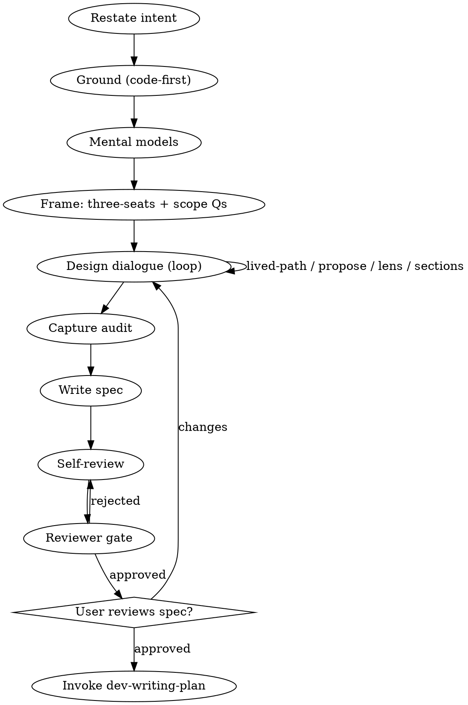

# Dev Brainstorm

Turn an idea into a spec through dialogue, grounded in code and encoded at the right abstraction level.

<HARD-GATE>
No implementation, no plan-writing, no subagent dispatch until a spec exists AND the user explicitly approves it. Engagement is not approval; only `yes`/`approved`/`proceed` clears the gate.
</HARD-GATE>

## Anti-pattern: "Too simple to need a spec"

Every change goes through this. The spec can be short. Skipping is where the most rework comes from.

## Checklist (TodoWrite-tracked, in order)

1. **Brainstorm-entry priming.** Before any tool use, produce chat-visible priming for entries tagged `brainstorm-entry`, `brainstorm-iteration`, `fix-iteration` (fix cycles) in `.claude/skills/dev-orchestrator/references/priming-anti-patterns.md`. Format: `**Priming**` + name + signal + countermove. "No applicable" requires enumeration.

2. **Restate user intent in one sentence.** Ambiguous? Ask before exploring.

3. **Ground in the primary source — code + config; docs are the index.** Code is the truth; a doc is a description that drifts (this is the orchestrator §Grounding rule, applied here). Output: the spec's Project-context section.
   - **Docs locate, code confirms.** Use the project's `CLAUDE.md` Documentation map to find which docs bear on this work, and read those — let the task decide, don't read a fixed list. Start with the core: the domain docs covering this topic, and the ADRs/invariants that record the codebase's design decisions and constraints. Then whatever the task calls for — a testing doc for verification work; a glossary only when terms are unfamiliar. One TodoWrite item per relevant doc; inapplicable → `N/A: <reason>`. Then **read the actual code/config those point to** and confirm what it does, including the path that actually runs it, not just the data shape. Close each item with a quoted line. Behavior claims cite the **code** `file:line` (primary), not docs. Verify every `file:line` by reading it this session — stale anchors misread downstream. Read any matching `docs/planning/investigations/` handoff too (the `dev-investigate` artifact); skip items it already covers. A source read earlier this session counts; don't re-quote unnecessarily.
   - **External sources.** When the subject names an external system/product/standard ("Stripe's webhook spec", "the OAuth 2.0 RFC", "a third-party REST API", "the iCalendar standard"), the spec MUST carry a "Project context — external sources" sub-section: cited URLs + claims from the source, not paraphrase or memory. WebFetch/WebSearch before drafting. Else `No external sources apply — <why>`.
   - **Posture.** The Project-context header declares grounding once ("grounded this session, verified by reading"); claims default to verified-by-reading-the-source, and any claim NOT read this session is inline-tagged `[assumed]` or `[secondary: <source>]` (a doc-only behavior claim is `[secondary: <doc>]` until confirmed against code). Marking the exceptions beats tagging every line.

4. **Apply mental models — grounded.** The orchestrator §Challenge already challenged the *framing* early (pre-grounding, broad). Here you apply 5–7 load-bearing models to the now-grounded specifics: per model, where it bites in THIS task (the file / decision / option it touches) and what it changes about the obvious-feeling design (the alternative it surfaces). A bare name-list fails. Produces the spec's `Mental models applied` section — it requires the docs/code from step 3, which is why it lands here, not at §Challenge.

5. **Frame + scope questions.**
   - **Three-seats** (one sentence each): **User** — what changes for the user; **Data-flow** — source → shared → server → transport → client → UI; **Abstraction** — right level of generality, could another consumer use the same pattern? *Provisional here* — the abstraction & reuse audit (step 7) finalizes this verdict.
   - **Scope-only clarifying questions** — one at a time, multiple-choice when discrete. Ground (step 3) already read the code — a question the code answers is not a user question; resolve it from your grounding (or a quick extra Grep/Read against the codebase or project docs) and move on. Surface only what genuinely isn't in code, docs, or sources: the user's intent, taste, or risk call — a fact is never a user question. The `file:line` evidence lives in the spec for the plan-author, not in the question — the user needs the decision, not the citation. Design-trade questions ("variant A or B of the mechanic?") are NOT asked here — they belong in the step-6 dialogue, once approaches exist.

6. **Design dialogue (iterative loop).**
   - **Trace the lived path first** (orchestrator self-check): walk one real use end to end across every layer (source → shared → server → transport → client → UI), and let it redesign. Its success + failure signals, each at a named layer, become step-8 acceptance criteria. No emitted signal on success or bad input = design gap; close it now.
   - **Propose 2–3 approaches**, recommendation first. Judge each through the abstraction & reuse lens as you propose — the recommendation must already reuse-not-duplicate and keep shared essence in one home. You cannot recommend a duplicating or case-fusing approach and audit it after; the audit (step 7) only records a judgment already made here.
   - **Design-trade questions** surface here (code-checked first).
   - **Present design sections one at a time; per-section assent.**
   - **Record** chosen + ≥1 structurally-different rejected approach into `Approaches considered`.

7. **Abstraction & reuse audit** (when the spec introduces a primitive, module, type, or named definition another part of the system builds on; else `audit N/A`). Run it per `.claude/skills/dev-orchestrator/references/review-gates/abstraction-and-reuse.md` and document under `## Abstraction & reuse audit`; the reviewer gate enforces the procedure and principle, so don't restate them. Brainstorm-specific: this finalizes the step-5 abstraction seat.

8. **Write the spec** → `docs/planning/specs/active/YYYY-MM-DD-<topic>.md`, frontmatter `Status: Awaiting Plan`. Sections: Intent, Three-seats, Mental models applied, Project context, Design, Approaches considered, Abstraction & reuse audit (or N/A), Acceptance criteria, Out of scope. Commit `docs: spec <topic>`.
   AC are Yes/No verifiable and name the observable signal (log line, event, record, rendered state). Include ≥1 failure-path criterion (bad input → an error signal + a structured log line, no state mutation). Banned: "works correctly", "feels right", "looks good", "handles edge cases", "as appropriate".

9. **Spec self-review** (fix inline):
   - Placeholders: `TBD`, `TODO`, `fill in`, `details to follow`, `Similar to <other>`, `Add appropriate <X>`.
   - Required sections present: `Mental models applied`, `Approaches considered`, `Abstraction & reuse audit` (or its explicit N/A).
   - Internal consistency; decompose if multi-subsystem (declare backend/frontend split).
   - Ambiguity: any requirement readable two ways → pick one.
   - Copouts: `pre-existing`, unjustified `out of scope`, `covered elsewhere`, `engine-proven`, `math is unit-tested`.
   - **Engine-state claims** ("already supports", "exists today", "already wired"): each needs an adjacent code `file:line`, and if the design relies on it, the code must have been read and confirmed — a citation is not verification (a real line can validate-and-reject where you assumed it writes; in-memory state can be transient where you assumed it persists). Flag any behavior claim still tagged `[secondary]`.
   - **AC layer**: steps are observable outcomes, not test code (`expect(...)`).

<HARD-GATE>
Dispatch the `dev-reviewer` agent for the spec just written:

- artifact-path: the spec file path just written
- artifact-type: `spec`
- reviews-output-path: `docs/planning/reviews/<slug>-spec.md` (`<slug>` = spec filename basename)
- references-base: `.claude/skills/dev-orchestrator/references/review-gates/`

Read the reviews file. `**Status:** approved` → step 10. `**Status:** rejected` → fix inline, re-dispatch, loop until approved. Do not self-review in place of dispatch (neutrality is the fresh context).
</HARD-GATE>

10. **Present spec for user review.** "Spec written and committed to `<path>`. Please review before we move to the plan." Wait for explicit approval; changes loop to step 6.

11. **Spec approved.** Note the spec path for writing-plan (plan inherits the slug).

12. **Transition to dev-writing-plan.** Terminal.

## Process flow

## Cross-cutting rules

Communication, engagement-vs-approval, hard-correction handling, length ceilings, jargon discipline — defined in `dev-orchestrator`. Re-read before every user-facing message.
